# 🛒 E-Commerce Conversion Prediction using Machine Learning

<p align="center">


</p>

---

# 🌐 Live Demo

### 🚀 Try the application here

**https://ecommerce-conversion-prediction.streamlit.app/**

Or click the badge below:

[](https://ecommerce-conversion-prediction.streamlit.app/)

---


# 📌 Project Overview

This project predicts whether an **e-commerce customer will complete a purchase (conversion)** using Machine Learning.

The project follows a complete **end-to-end ML pipeline**, including:

- Exploratory Data Analysis (EDA)
- Feature Engineering
- Data Preprocessing
- Model Training
- Hyperparameter Tuning
- Model Explainability (SHAP)
- Performance Comparison
- Streamlit Deployment

The final deployed model is **XGBoost**, selected after comparing multiple machine learning algorithms.

---

# 🎯 Problem Statement

Businesses spend significant resources attracting visitors to their websites.

However, only a small percentage of visitors actually make a purchase.

The objective of this project is to predict whether a customer will convert based on browsing behavior and customer characteristics.

This prediction helps businesses improve:

- Marketing campaigns
- Personalized recommendations
- Customer targeting
- Revenue generation

---

# 📂 Dataset Features

The dataset contains customer browsing information such as:

- User_ID
- Age
- Income
- City Tier
- Device Type
- Traffic Source
- Pages Viewed
- Products Viewed
- Time On Site
- Previous Purchases
- Discount Seen
- Browser Version
- Campaign Code

Target Variable

```
Converted
```

- 1 → Customer Converted
- 0 → Customer Did Not Convert

---

# ⚙️ Feature Engineering

Three additional features were created:

| Feature | Description |
|----------|-------------|
| Views_Per_Product | Pages Viewed / Products Viewed |
| Purchase_Engagement | Pages Viewed × Previous Purchases |
| Time_Per_Page | Time On Site / Pages Viewed |

These engineered features improved overall model performance.

---

# 🛠️ Machine Learning Pipeline

```
Raw Dataset
      │
      ▼
Exploratory Data Analysis
      │
      ▼
Feature Engineering
      │
      ▼
Data Preprocessing
      │
      ▼
Train-Test Split
      │
      ▼
Model Training
      │
      ▼
Hyperparameter Tuning
      │
      ▼
Model Evaluation
      │
      ▼
SHAP Explainability
      │
      ▼
Prediction Pipeline
      │
      ▼
Streamlit Dashboard
```

---

# 🤖 Models Trained

The following machine learning models were trained and compared:

- Logistic Regression
- Random Forest
- Tuned Random Forest
- XGBoost (Best Model)

---

# 📊 Model Performance

| Model | Accuracy | Precision | Recall | F1 Score |
|--------|----------|-----------|--------|----------|
| Logistic Regression | 0.7105 | 0.5576 | 0.2982 | 0.3886 |
| Random Forest | 0.6935 | 0.5054 | 0.3047 | 0.3802 |
| Tuned Random Forest | 0.7065 | 0.5391 | 0.3355 | 0.4136 |
| **XGBoost** | **0.6980** | **0.5156** | **0.3485** | **0.4159** |

Although Logistic Regression achieved the highest accuracy, **XGBoost produced the best F1 Score and Recall**, making it the preferred model for this imbalanced classification problem.

---

# 📈 Model Comparison

<p align="center">
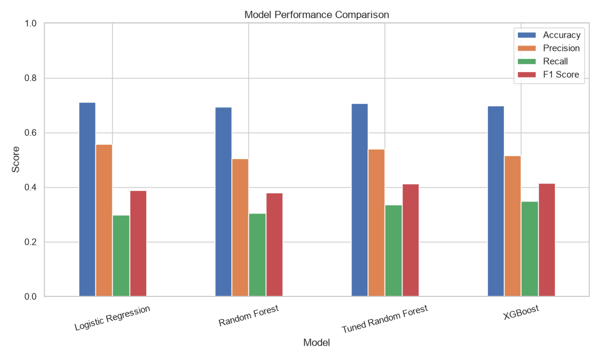
</p>

---

# 📊 Exploratory Data Analysis

## Missing Values

<p align="center">
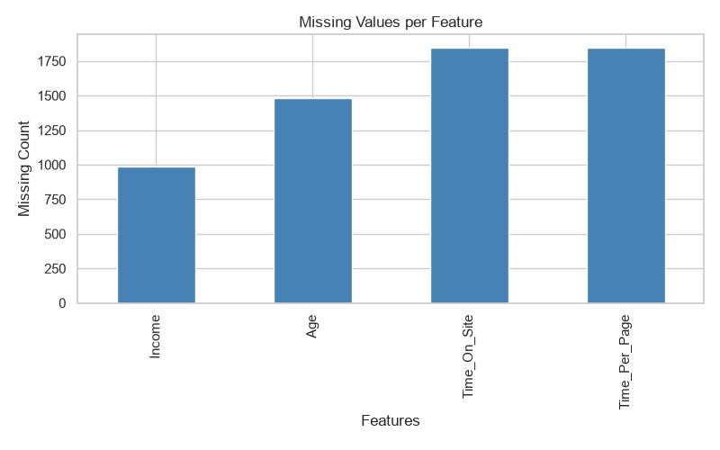
</p>

---

## Target Distribution

<p align="center">
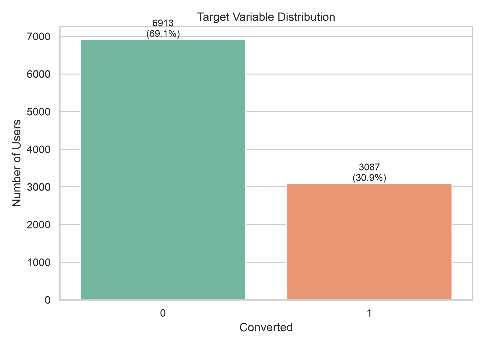
</p>

---

## Correlation Heatmap

<p align="center">
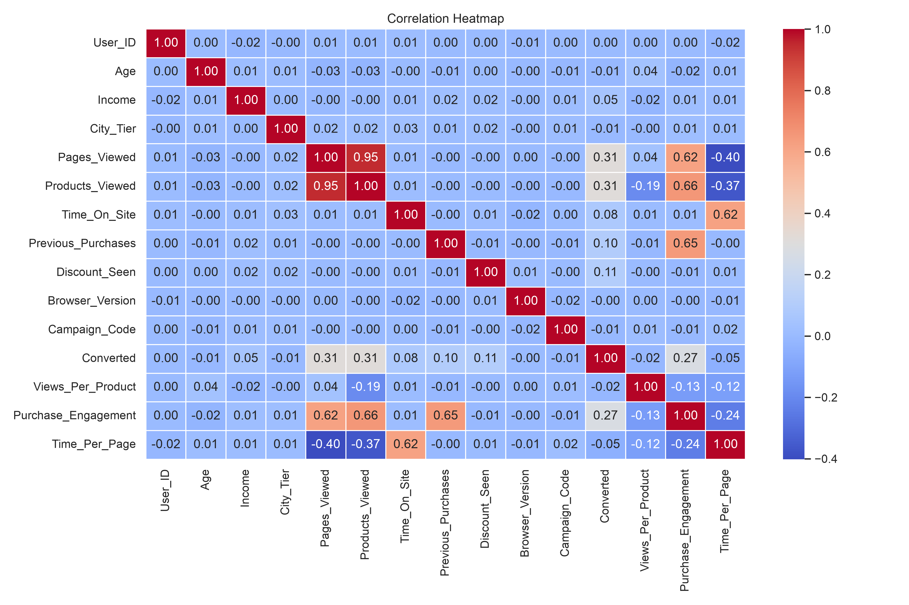
</p>

---

# 🔥 Feature Importance (XGBoost)

The XGBoost model identifies the most influential features affecting customer conversion.

<p align="center">
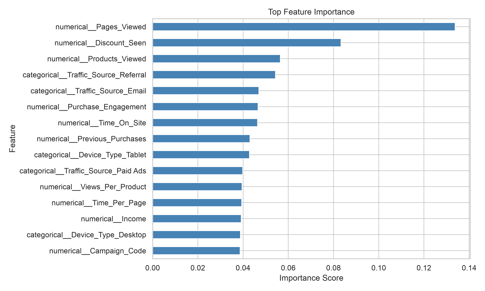
</p>

---

# 🧠 SHAP Explainability

SHAP values explain how each feature contributes to the model's prediction.

<p align="center">
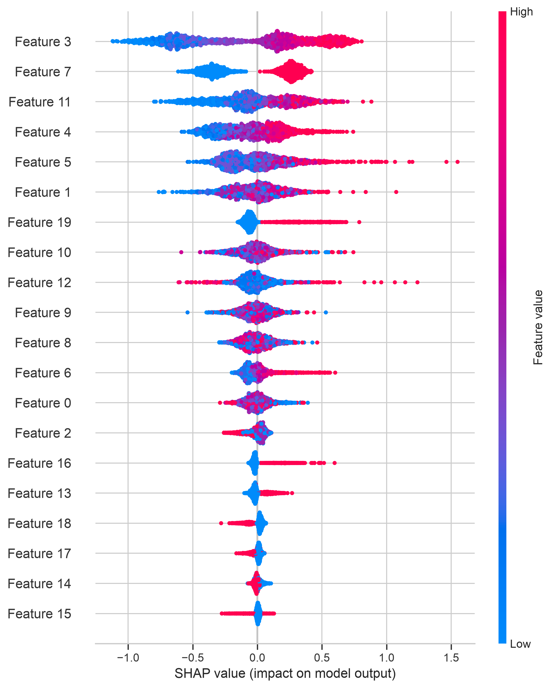
</p>

---

# 📈 ROC Curves

## Logistic Regression

<p align="center">
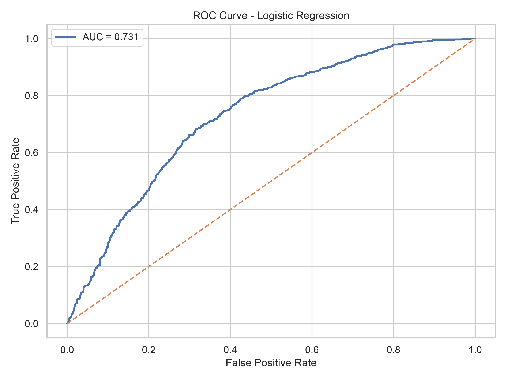
</p>

---

## Random Forest

<p align="center">
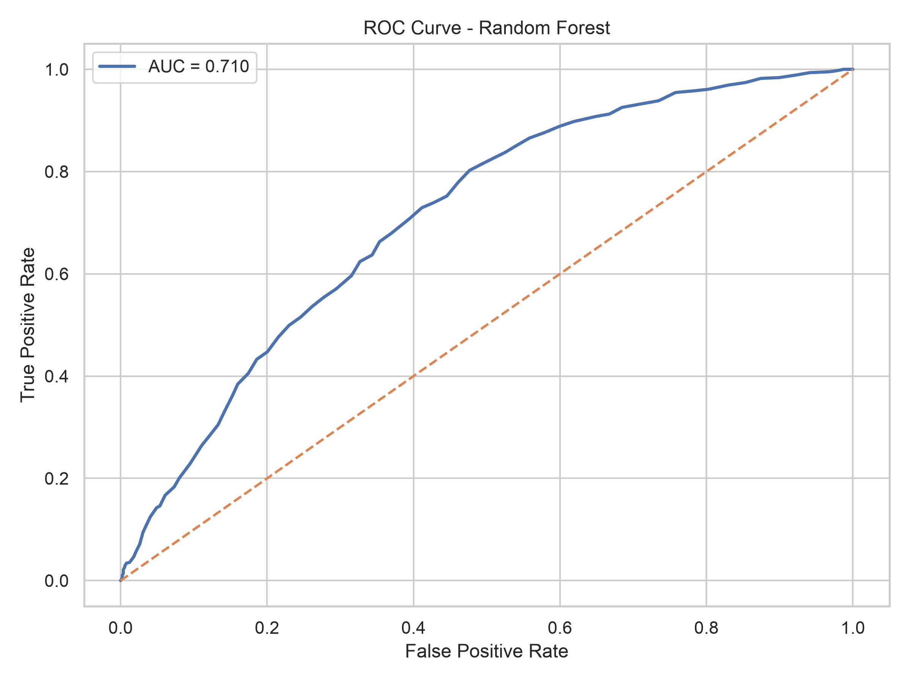
</p>

---

## Tuned Random Forest

<p align="center">
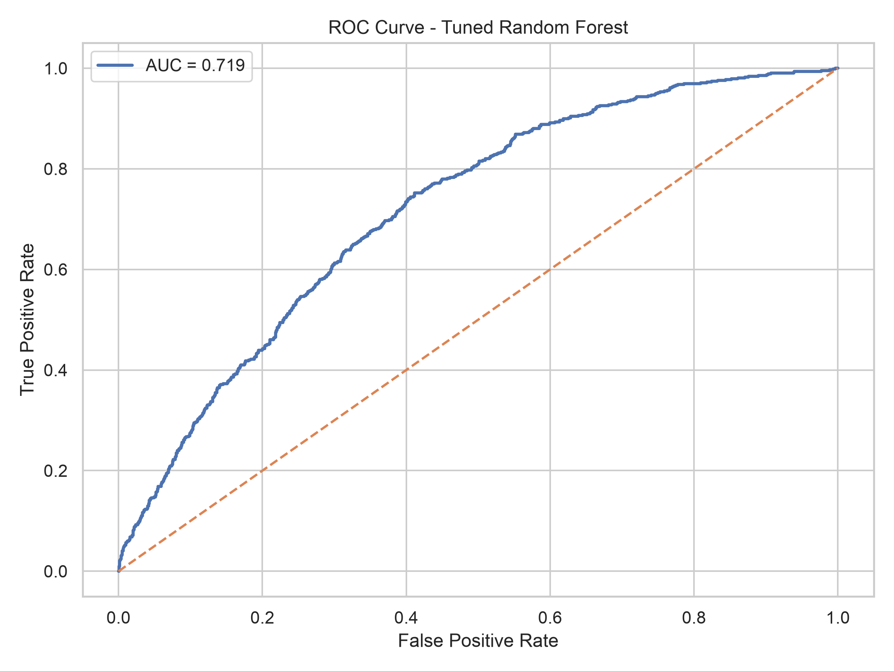
</p>

---

## XGBoost

<p align="center">
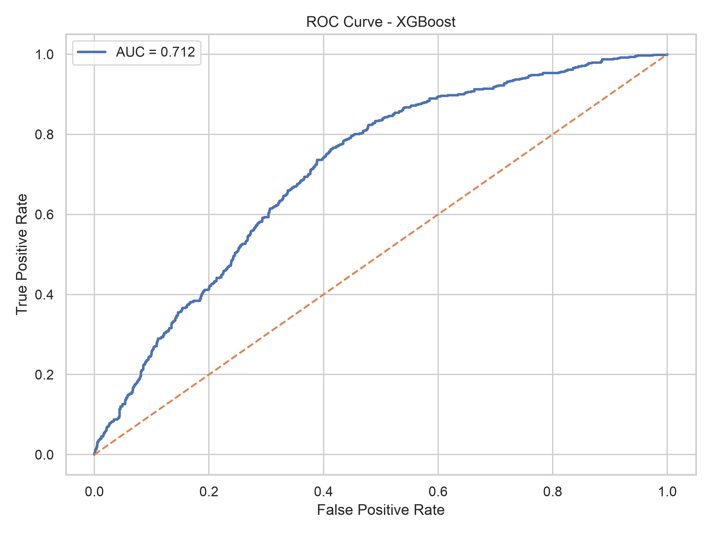
</p>

---

# 📉 Precision-Recall Curves

## Logistic Regression

<p align="center">
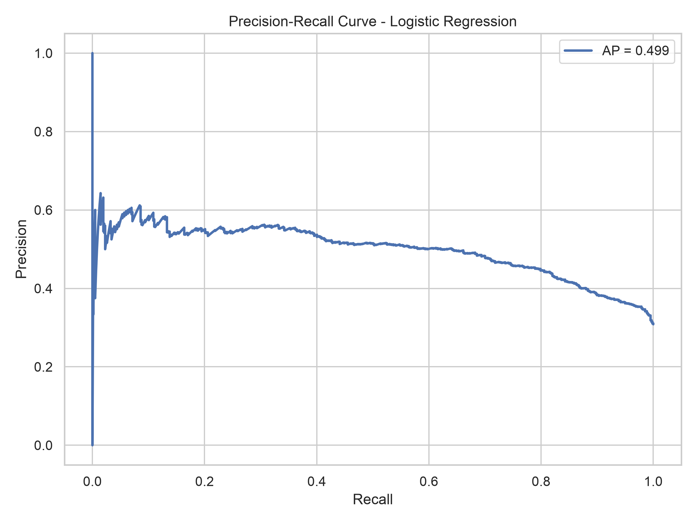
</p>

---

## Random Forest

<p align="center">
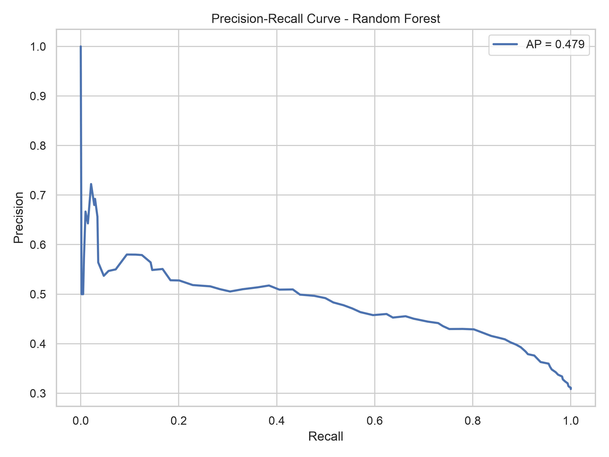
</p>

---

## Tuned Random Forest

<p align="center">
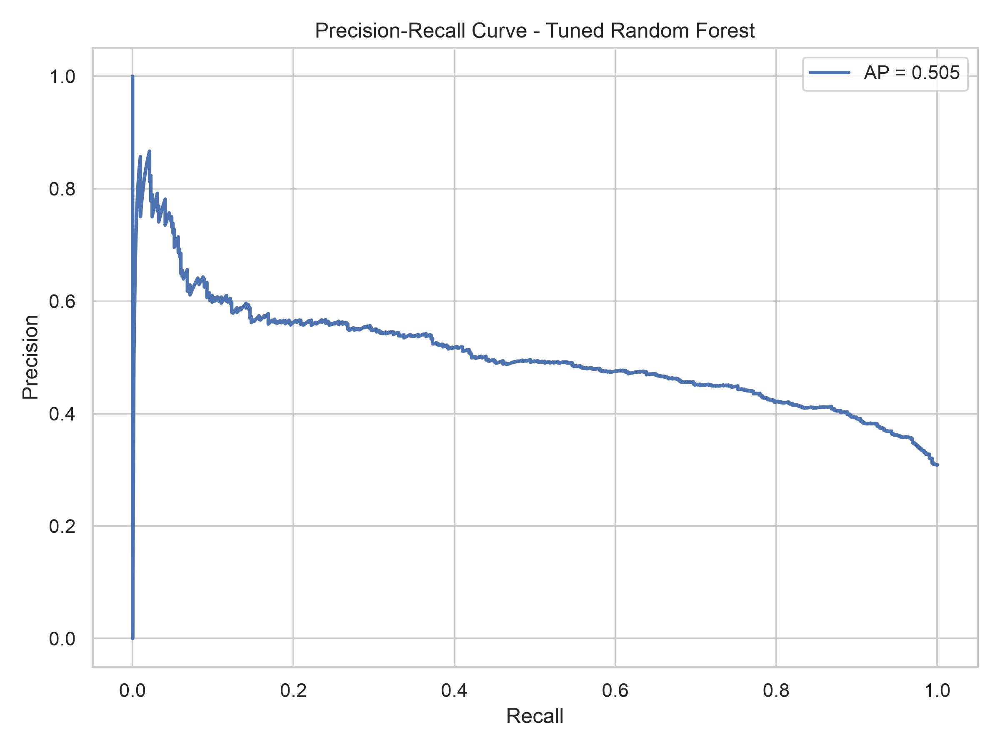
</p>

---

## XGBoost

<p align="center">
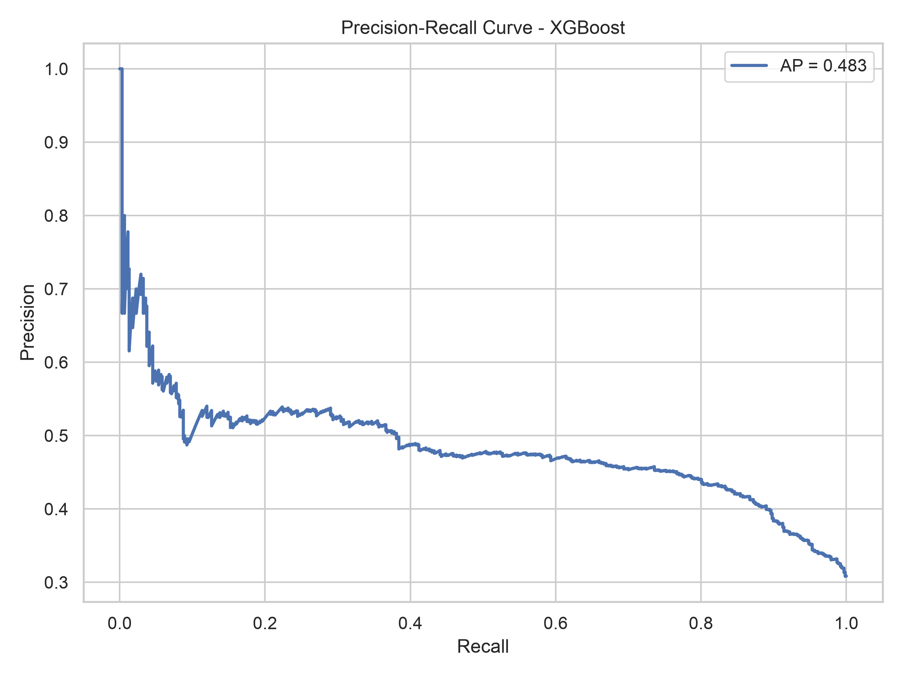
</p>

---

# 💻 Interactive Streamlit Dashboard

The project includes an interactive Streamlit dashboard that allows users to:

- Upload customer CSV files
- Predict customer conversions
- Download prediction results
- View model metrics
- Compare ML models
- Explore Feature Importance
- Understand SHAP explanations

> Add your dashboard screenshot below.

<p align="center">

</p>

---

# 📁 Project Structure

```
Ecommerce-Conversion-Prediction/
│
├── data/
│   ├── raw/
│   └── processed/
│
├── models/
│   ├── xgboost_model.pkl
│   └── preprocessor.pkl
│
├── reports/
│   ├── figures/
│   └── results/
│
├── src/
│   ├── config.py
│   ├── data_loader.py
│   ├── eda.py
│   ├── preprocessing.py
│   ├── feature_engineering.py
│   ├── model.py
│   ├── tuning.py
│   ├── evaluate.py
│   ├── validation.py
│   ├── predict.py
│   └── visualization.py
│
├── app.py
├── main.py
├── requirements.txt
└── README.md
```

---

# 🚀 Installation

Clone the repository

```bash
git clone https://github.com/Pawan41/Ecommerce-Conversion-Prediction
```

Move into the project

```bash
cd Ecommerce-Conversion-Prediction
```

Create virtual environment

```bash
python -m venv venv
```

Activate

### Windows

```bash
venv\Scripts\activate
```

### Mac/Linux

```bash
source venv/bin/activate
```

Install dependencies

```bash
pip install -r requirements.txt
```

---

# ▶️ Run Training

```bash
python main.py
```

---

# 🌐 Run Streamlit Dashboard

```bash
streamlit run app.py
```

---

# 📦 Libraries Used

- Python
- Pandas
- NumPy
- Matplotlib
- Seaborn
- Scikit-learn
- XGBoost
- SHAP
- Streamlit
- Joblib

---

# 📌 Future Improvements

- LightGBM implementation
- CatBoost implementation
- Deep Learning Model
- Ensemble Learning
- MLflow Experiment Tracking
- Docker Deployment
- CI/CD Pipeline
- Cloud Deployment (AWS / Azure / GCP)

---

# 👨‍💻 Author

**Pawan Kumar**

M.Tech (Computer Science - Data Science)

Machine Learning | Data Science | AI | Python

GitHub: https://github.com/Pawan41

LinkedIn: www.linkedin.com/in/pawan-kumar-117533200

---

# ⭐ If you found this project useful, don't forget to star the repository!